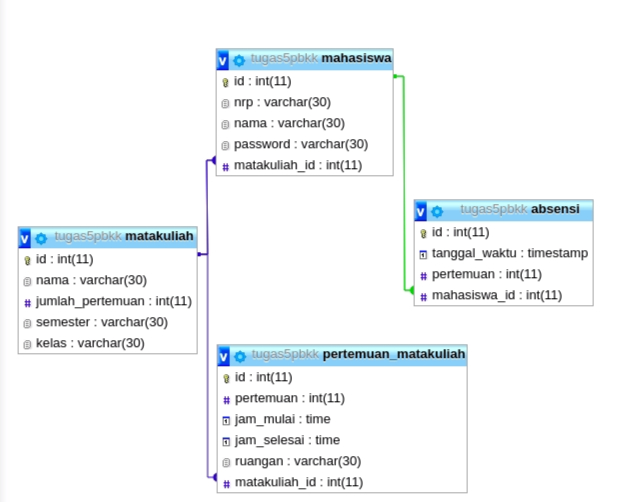

# Pemrograman Berbasis Kerangka Kerja
## Kelompok 5
## Tugas Sistem Kehadiran Online

     1. Naufal Pranasetyo F.   05111540000057
     2. Muhammad Akram A.      05111540000050
     3. Hilmi Raditya P.       05111640000164
    
---

Tools yang digunakan: 
- [expressJS](https://expressjs.com/)
- [MySQL](https://www.mysql.com/) 
- [Template Engine Handlebars](https://www.npmjs.com/package/express-handlebars)
   
## Cara Menjalankan:
1. Clone repository ini, buka folder dan masuk terminal
2. Jalankan `npm install express --save`
3. Jalankan `npm install`
4. Nyalakan server MySQL, jalankan `node index.js`
5. Buka browser menuju ke halaman http://localhost:8000

## Endpoint List API
1. POST `/absen` Untuk melakukan absen  
*sent via body: nrp, pertemuan*

2. GET `/rekap/:idmatkul` Untuk melihat rekap kuliah per semester

3. GET `rekap/:idmatkul/:pertemuanke` untuk Melihat rekap kuliah per pertemuan

4. GET `/rekapmahasiswa/:nrp/:idmatkul` untuk Melihat rekap per mahasiswa per matkul

5. GET `/rekapmahasiswasemester/:nrp/:idsemester` untuk Melihat rekap per mahasiswa per semester 

6. POST `/tambahmahasiswa` Untuk menambah data mahasiswa  
*sent via body: nrp, nama, password*

7. POST `/tambahpeserta/` Untuk menambah peserta ke mata kuliah dan kelas tertentu  
*sent via body: nrp, matakuliah_id*

8. POST `/tambahmatkul` Untuk menambah data mata kuliah  
*sent via body: nama, semester, kelas*

9. POST `/tambahjadwal` Untuk menambah jadwal kelas  
*sent via body: matakuliah_id, pertemuan, ruangan, jam_mulai, jam_selesai*

Desain Database

