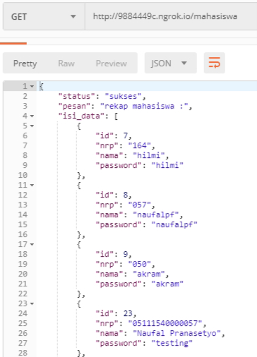
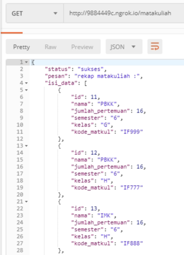
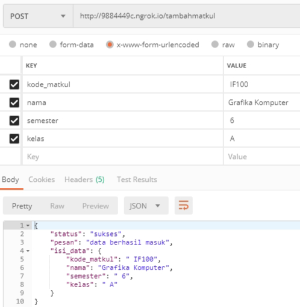
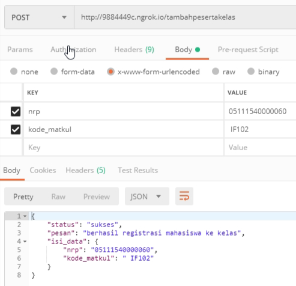
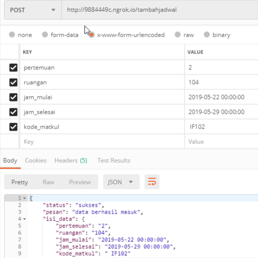
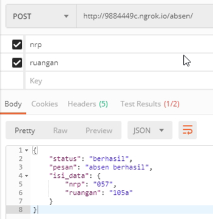
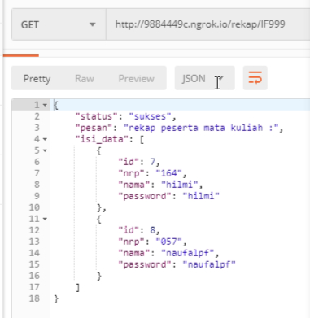
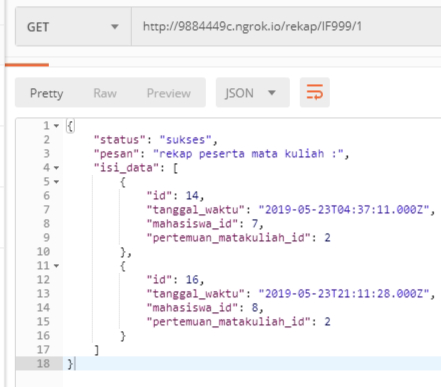
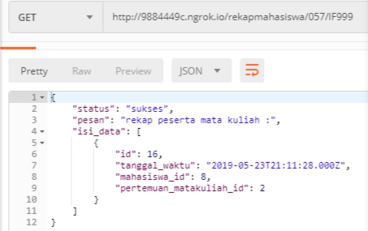

# Pemrograman Berbasis Kerangka Kerja
## Kelompok 5
## Tugas Sistem Kehadiran Online

     1. Naufal Pranasetyo F.   05111540000057
     2. Muhammad Akram A.      05111540000050
     3. Hilmi Raditya P.       05111640000164
    
---

## Teknologi yang digunakan: 
- Framework: [expressJS](https://expressjs.com/)
- Database: [MySQL](https://www.mysql.com/) 
- Front-end: [Template Engine Handlebars](https://www.npmjs.com/package/express-handlebars)
   
## Cara Menjalankan:
1. Clone repository ini, buka folder dan masuk terminal
2. Jalankan `npm install express --save`
3. Jalankan `npm install`
4. Nyalakan server MySQL, jalankan `node index.js`
5. Buka browser menuju ke halaman http://localhost:8000

## Endpoint List API

Test API dapat diakses di halaman http://10.151.33.43:8000/ atau http://9884449c.ngrok.io 

API Cek Database
Terdapat 2 tabel yang dapat diakses, yaitu Tabel Mahasiswa dan Tabel matakuliah 
`GET /mahasiwa` 
Hasilnya:

`GET /matakuliah`
Hasilnya: 

1. POST `/tambahmahasiswa` Untuk menambah data mahasiswa  
- *sent via body: nrp, nama, password*
- Hasilnya

2. POST `/tambahmatkul` Untuk menambah data mata kuliah  
- *sent via body: kode_matkul, nama, semester, kelas*
- Hasilnya

3. POST `/tambahpesertakelas/` Untuk menambah peserta ke mata kuliah dan kelas tertentu  
- *sent via body: nrp, id_matkul*
- Hasilnya

4. POST `/tambahjadwal` Untuk menambah jadwal kelas  
- *sent via body: matakuliah_id, pertemuan, ruangan, jam_mulai, jam_selesai*
- Hasilnya

5. POST `/absen` Untuk melakukan absen  
- *sent via body: nrp, ruangan*
- Hasilnya

6. GET `/rekap/:idmatkul` Untuk melihat rekap kuliah per semester

7. GET `rekap/:idmatkul/:pertemuanke` untuk Melihat rekap kuliah per pertemuan
- Contoh: http://9884449c.ngrok.io/rekap/IF999/1
- Hasilnya 

8. GET `/rekapmahasiswa/:nrp/:idmatkul` untuk Melihat rekap per mahasiswa per matkul

9. GET `/rekapmahasiswasemester/:nrp/:idsemester` untuk Melihat rekap per mahasiswa per semester 

Desain Database

