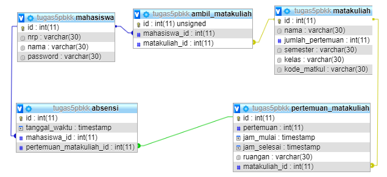

# Pemrograman Berbasis Kerangka Kerja
## Kelompok 5
## Tugas Sistem Kehadiran Online
   
   - **Naufal Pranasetyo   05111540000057**
   - **Muhammad Akram A.   05111540000050**
   - **Hilmi Raditya P.    05111640000164**

Tools yang digunakan: 
- [expressJS](https://expressjs.com/)
- [MongoDB](https://www.mongodb.com/) 
- [Template Engine hbs](https://github.com/pillarjs/hbs)
   
## Cara Menjalankan:
1. Clone repository ini, buka folder dan masuk terminal
2. Jalankan `npm install express --save`
3. Jalankan `npm install`
4. Nyalakan server MongoDB, jalankan `node index.js`
5. Buka browser menuju ke halaman http://localhost:8000
6. Buka terminal untuk melihat log saat gagal dan berhasil login

Desain Database

